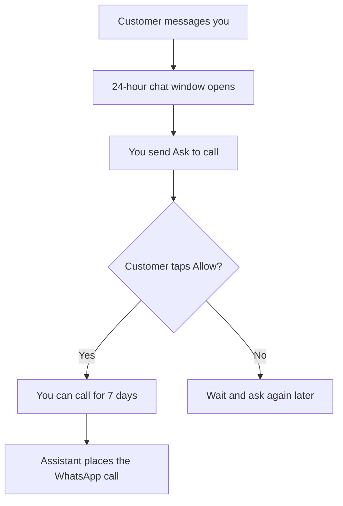

WhatsApp Calling lets your AI assistant answer voice calls on your WhatsApp Business number, and place outbound WhatsApp calls after the customer agrees.

These rules come from WhatsApp. They apply to every business on the platform — not only this product.

<Info>
**Start here** — Customers can always call you. You cannot call a brand-new number that has never written to you. They must message you first, then you ask for permission, then they tap Allow.
</Info>

## What you can do

<CardGroup cols={2}>
  <Card title="Inbound calls" icon="phone-arrow-down-left">
    Anyone can call your WhatsApp Business number. Your connected assistant answers automatically.
  </Card>
  <Card title="Outbound calls" icon="phone-arrow-up-right">
    After a customer allows calling, you can place WhatsApp voice calls to them for 7 days. The same assistant handles the conversation.
  </Card>
</CardGroup>

## How outbound calling works

<Steps>
  <Step title="The customer writes to you">
    They send a WhatsApp message to this sender, or they reply after you send a regular approved template. That opens a **24-hour chat window**.

    A Voice Call Request will **not** be delivered to a number that has never written to you.
  </Step>
  <Step title="You ask for permission">
    In the conversation, click **Ask to call**. WhatsApp shows the customer a permission card. They tap Allow or Decline.
  </Step>
  <Step title="They allow">
    Consent lasts **7 days**. During that window you can place WhatsApp calls from the conversation, the API, or automations.
  </Step>
  <Step title="You call">
    Click **Call**. Your assistant places the WhatsApp voice call. When the call ends, the usual post-call webhook and transcript still apply.
  </Step>
</Steps>

## WhatsApp limits you will hit

These are WhatsApp limits. If a request or call is blocked, it is almost always one of the rows below.

| Limit | What it means |
|-------|----------------|
| Open 24-hour chat | The customer must have messaged this sender in the last 24 hours before you can ask to call |
| 1 ask / 24 hours | Typically one permission request per contact per day. WhatsApp resets this after a **connected** call (they answered, inbound or outbound) |
| 2 asks / week | Typically two permission requests per contact per week. Same reset after a connected call |
| 7-day consent | After they allow, you can call for 7 days, then you must ask again |
| Unanswered calls | WhatsApp can revoke consent after several unanswered business calls |
| Messaging limit | The sender needs at least **2,000 messages / 24 hours** before calling can be enabled |
| Number type | Calling is not available with Coexistence (WhatsApp Business app). Use a Dedicated Platform Number or an External Mobile Number |
| Business country | You can receive inbound WhatsApp calls on any supported sender. **Ask to call** and outbound WhatsApp calls are not available when the **business number** is in the United States, Canada, Egypt, Vietnam, Nigeria, or Türkiye. The customer's country does not matter. |

<Tip>
**New contact?** Send a normal utility or marketing template first. Wait until they reply. Then Ask to call. Do not start with the voice-call template — WhatsApp will not deliver it.
</Tip>

## Enable calling on a sender

1. Open **WhatsApp Senders**
2. Confirm the sender is **online**, has an assistant, and shows a messaging limit of at least 2,000 / 24hr
3. Click **Enable Calling**
4. Review the permission-request text (created automatically if you do not already have a Voice Call Request template)

The **WhatsApp Calling** card on that page explains the same flow in the dashboard.

<Warning>
Coexistence senders (numbers also used in the WhatsApp Business app) cannot use calling. Create a Dedicated Platform Number or connect an External Mobile Number instead.
</Warning>

## Using calling in conversations

Once calling is enabled:

- **Ask to call** appears when the contact has not granted permission yet
- **Call** appears after they allow, until consent expires
- The chat shows activity lines when you asked, when they allowed or declined, and when a call happened

Hover **Ask to call** to see why the button is disabled (for example, you already asked in the last 24 hours).

## API and events

You can ask for permission, check status, and place a call from your own systems:

- [Get call permission](/api-reference/whatsapp/get-call-permission)
- [Request call permission](/api-reference/whatsapp/request-call-permission)
- [Place a WhatsApp call](/api-reference/whatsapp/place-whatsapp-call)
- [WhatsApp voice events](/api-reference/webhooks/whatsapp-voice-webhook)

Completed WhatsApp calls also send the regular [post-call webhook](/api-reference/webhooks/post-call-webhook) if that is enabled on the assistant.

## FAQ

<AccordionGroup>
  <Accordion title="Why can't I call a new phone number directly?">
    WhatsApp does not allow businesses to cold-call or cold-ask numbers that have never written to them. The customer must message you first (or reply to a regular template). That is a WhatsApp rule, not a setting you can turn off here.
  </Accordion>
  <Accordion title="Ask to call did nothing / the customer never saw the request">
    The 24-hour chat window was probably closed. Send a regular approved template, wait for their reply, then ask again. WhatsApp typically allows one ask per contact every 24 hours (two per week) unless a connected call reset that counter. If a previous ask failed to deliver, you may still have to wait.
  </Accordion>
  <Accordion title="The customer allowed, but Call is still missing">
    Confirm calling is still enabled on the sender, the assistant is assigned, and consent has not expired (7 days). Refresh the conversation. If they declined or WhatsApp revoked consent after unanswered calls, you must ask again (subject to the daily/weekly caps).
  </Accordion>
  <Accordion title="Can customers call me without asking first?">
    Yes. Inbound WhatsApp calls do not need a permission request. Anyone who has your WhatsApp number can call it. Your assistant answers.
  </Accordion>
  <Accordion title="Ask to call failed / the customer never saw Allow or Decline">
    If the sender is a US, Canadian, Egyptian, Vietnamese, Nigerian, or Turkish number, WhatsApp does not allow businesses to request outbound calling permission. Inbound calls still work. Use a sender from a supported country to ask and call out.
  </Accordion>
  <Accordion title="Does this work with the WhatsApp Business app on my phone?">
    No. Calling is not supported on Coexistence. Use a Dedicated Platform Number or an External Mobile Number that is not paired with the WhatsApp Business app.
  </Accordion>
  <Accordion title="Why is Enable Calling unavailable?">
    The sender must be online, have an assistant, have a messaging limit of at least 2,000 / 24hr, and not be a Coexistence number. Open **Calling unavailable** on the sender for the exact reason.
  </Accordion>
  <Accordion title="Are WhatsApp calls billed like phone calls?">
    Yes — the assistant still runs a live voice conversation. Minutes (or your plan's voice usage) are consumed. Keep a positive balance before placing calls.
  </Accordion>
  <Accordion title="Can I use this from automations or my backend?">
    Yes. In the automation platform, use the **WhatsApp voice event** trigger plus **Request WhatsApp call permission** and **Place WhatsApp call**. Or call the WhatsApp calling API with your API key. The same WhatsApp limits apply — neither path lets you skip the chat window or consent.
  </Accordion>
</AccordionGroup>

## Troubleshooting

| What you see | What to do |
|--------------|------------|
| Ask to call is disabled | Read the button tooltip. Usually you already asked in the last 24 hours, or they already granted permission. |
| Request never arrives | Open chat window first (customer must message you). Then ask. If the sender is a US/CA/EG/VN/NG/TR number, WhatsApp will never deliver Ask to call — inbound still works. |
| Customer says they never got a call | Confirm they tapped Allow, consent is still valid, and your balance is not empty. |
| Enable Calling is hidden | Sender is Coexistence, offline, missing an assistant, or under the 2,000 / 24hr messaging limit. |
| Calls fail right after you enable | Wait a few minutes and retry. If it still fails, disable calling and enable it again. |

More WhatsApp setup issues: [WhatsApp troubleshooting](/troubleshooting/whatsapp).

## WhatsApp resources

Official WhatsApp / Meta documentation (limits can change on their side):

- [WhatsApp Cloud API Calling](https://developers.facebook.com/docs/whatsapp/cloud-api/calling)
- [User-initiated calls](https://developers.facebook.com/docs/whatsapp/cloud-api/calling/user-initiated-calls)
- [Business-initiated calls](https://developers.facebook.com/docs/whatsapp/cloud-api/calling/business-initiated-calls)
- [Messaging limits](https://developers.facebook.com/docs/whatsapp/messaging-limits)
- [Template messages](https://developers.facebook.com/docs/whatsapp/cloud-api/guides/send-message-templates)

## Next steps

- [Enable calling on a sender](/whatsapp/senders)
- [Voice Call Request templates](/whatsapp/templates)
- [WhatsApp conversations](/whatsapp/conversations)
- [Calling API](/api-reference/whatsapp/request-call-permission)
